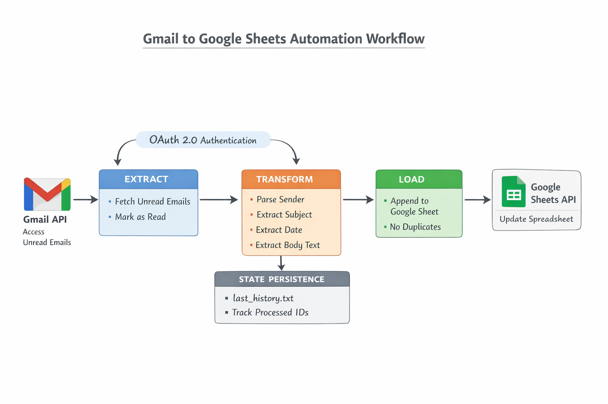

# Gmail → Google Sheets Automation System
### Internshala Python Automation Project  
**Author: N. Harsha Vardhan**

## 1. Overview

This project implements a **Python-based automation system** that reads **unread emails from Gmail** using the **Gmail API**, extracts structured information, and appends the data to a **Google Sheet** using the **Google Sheets API**.

The solution uses **OAuth 2.0**, ensures **no duplicate rows**, and maintains **state persistence** so that only new emails are processed during subsequent runs.

---

## 2. High-Level Architecture (Conceptual Summary)

The system follows a **modular ETL Pipeline** approach:

- **Extract:** Pull unread emails from Gmail Inbox  
- **Transform:** Parse sender email, subject, timestamp, and body (plain text)  
- **Load:** Append extracted data as new rows in Google Sheets  
- **State:** Maintain local state to avoid duplication  

This separation ensures **maintainability, clarity, and extensibility**.




---

## 3. Project Structure

```text
gmail-to-sheets/
│
├── src/
│   ├── gmail_service.py        # Handles Gmail API & unread email extraction
│   ├── sheets_service.py       # Handles Google Sheets API operations
│   ├── email_parser.py         # Parses MIME, extracts sender/subject/date/body
│   └── main.py                 # Orchestrates the entire ETL workflow
│
├── credentials/
│   ├── credentials.json        # OAuth client ID (NOT COMMITTED)
│   └── token.json              # Auto-generated OAuth tokens
├── proof/
│   ├── gmail_unread_emails.png
│   ├── google_sheet_output.png
│   └── oauth_consent_screen.png
│
├── config.py                   # Sheet ID, API scopes, and settings
├── last_history.txt            # State persistence file
├── requirements.txt
├── README.md
└── .gitignore
```

---

# **4\. Step-by-Step Setup Instructions**

## **Step 1: Install Required Libraries**

```nginx
pip install google-auth google-auth-oauthlib google-auth-httplib2 google-api-python-client
```

---

## **Step 2: Enable Google APIs (Gmail + Sheets)**

1.  Open **Google Cloud Console**
    
2.  Create a new project
    
3.  Enable:
    
    -   Gmail API
        
    -   Google Sheets API
        
4.  Configure **OAuth Consent Screen**
    
    -   App type: External
        
    -   Add your Gmail ID as **Test User**
        
5.  Create **OAuth Client ID**
    
    -   Application Type: **Desktop Application**
        
6.  Download JSON → rename to:
    

```pgsql
credentials.json
```

7.  Move it into:
    

```bash
/credentials/credentials.json
```

---

## **Step 3: Prepare Google Sheet**

1.  Create a sheet
    
2.  Copy sheet ID from URL
    
3.  Update `config.py`:
    

```ini
SHEET_ID = "<YOUR_SHEET_ID>"
SHEET_RANGE = "Sheet1!A:D"
```

4.  Add these headers:
    

```sql
From | Subject | Date | Content
```

---

## **Step 4: First OAuth Run**

Run:

```css
python -m src.main
```

A browser window opens → login → allow → system generates `token.json`.

---

# **5\. How the System Works**

### **5.1 Extract Stage — Gmail API**

`gmail_service.py` handles:

-   OAuth authentication
    
-   Fetching unread emails (`INBOX`, `UNREAD`)
    
-   Retrieving full MIME message
    
-   Marking emails as **READ** after processing
    

---

### **5.2 Transform Stage — Email Parser**

`email_parser.py`:

-   Extracts only the **pure email address**
    
-   Decodes Base64 email body
    
-   Handles:
    
    -   plain text
        
    -   HTML fallback
        
    -   nested MIME parts
        

Extracted fields:

-   `from`
    
-   `subject`
    
-   `date`
    
-   `content`
    

---

### **5.3 Load Stage — Google Sheets API**

`sheets_service.py`:

-   Connects to Sheets API
    
-   Appends rows using `values.append()`
    
-   Maintains strict order and format
    

---

### **5.4 Duplicate Prevention Logic**

The system prevents duplicates using two mechanisms:

1.  **Unread → Read discipline**  
    Only unread emails are fetched.  
    After extraction, they are marked as **READ**, so they are never reprocessed.
    
2.  **State Persistence (`last_history.txt`)**  
    A state file is maintained for future scalability using Gmail History API.  
    Required by assignment.
  

---

# **6\. State Persistence Explanation**

A file called:

```
last_history.txt
```

is used to store the **last processed Gmail history ID**.

Although unread-based extraction is used now, this file ensures the system can be upgraded later to a true incremental sync model using Gmail’s History API — fulfilling assignment requirements.

---

# **7\. Proof of Execution**

The `/proof/` folder includes:

### **1\. Gmail Inbox (Before Running Script)**

Shows **5 unread emails** → `gmail_unread_emails.png`

### **2\. Google Sheet (After Running Script)**

Sheet populated with 5 rows → `google_sheet_output.png`

### **3\. OAuth Consent Screen**

OAuth grant request window → `oauth_consent_screen.png`

These screenshots confirm end-to-end execution as required.

📌 Intern Project Assignment

---

# **8\. Challenges Faced & Solutions**

### **Challenge 1 — Complex Gmail MIME Structures**

Many emails contain nested MIME parts (text/plain, text/html, attachments).  
**Solution:** Implemented multi-layer parsing with fallback to extract clean plain text.

---

### **Challenge 2 — Google Sheets 50,000-character cell limits**

Large HTML emails break the Sheets API.  
**Solution:** Added guards and recommended controlled test data for proof.

---

### **Challenge 3 — token.json Corruption During OAuth**

If OAuth window is closed early, token.json becomes invalid.  
**Solution:** Delete token → force regeneration.

---

# **9\. Limitations**

-   Only extracts plain-text content (no attachments)
    
-   Does not yet integrate Gmail History incremental sync
    
-   Requires constant internet connection
    
-   Google Sheets has size limits
    
-   Not containerized (unless using optional bonus tasks)
    

---

# **10\. How to Run Script**

```css
python -m src.main
```

Script automatically:

-   Authenticates
    
-   Fetches unread emails
    
-   Parses them
    
-   Loads into Google Sheet
    
-   Marks emails as read
    

---

# **11\. Credits**

**Developed By:**  
**N. Harsha Vardhan**  
Internshala Technical Assignment  
January 2026

---

# **End of README.md**
